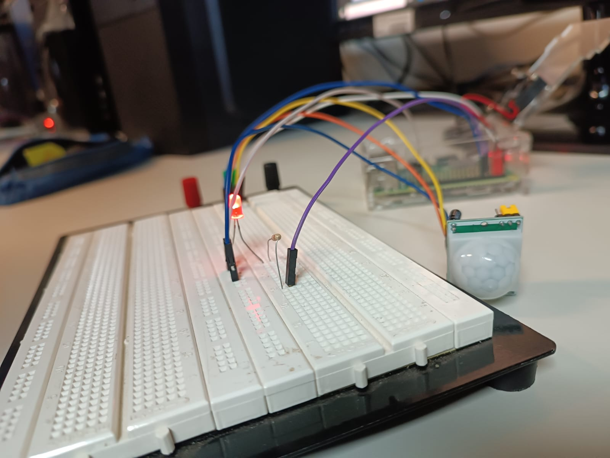

# Atividade Prática - Sistemas Embarcados: Experimento 2

## Descrição Geral
Esta pasta contém os códigos desenvolvidos para as três partes da atividade prática de Sistemas Embarcados, utilizando Python para interação com hardware (GPIO, sensores, atuadores, etc.).

## Estrutura dos Arquivos e Descrição

- Parte 1
  - **botao_ativadorV2.py**: Código para controle de um botão ativador, detectando eventos de pressionamento e liberando ações associadas.
  - **contador_regressivo2.py**: Implementa um contador regressivo, exibindo a contagem no console e em hardware, com lógica de temporização.
  - **historico_comandos.txt**: Registro dos comandos utilizados durante o desenvolvimento e testes da parte 1.
  
  - Abaixo está visível uma foto de montagem envolvida na parte 1:

- Parte 2
  - **pwm.py**: Demonstra o controle de PWM (modulação por largura de pulso) para ajuste de intensidade de LEDs, motores ou outros atuadores.
Abaixo está visível uma foto da forma de onda exibida pelo osciloscópio no pino de PWM:

  - **PIR_sensor.py**: Realiza a leitura de um sensor PIR (movimento), acionando eventos ou notificações ao detectar presença.
Abaixo está visível uma foto da montagem usada para o estudo do sensor PIR

- Parte 3
  - **exemplo_multithreaded.py**: Exemplo de uso de multithreading para executar tarefas concorrentes, útil para lidar com múltiplos sensores ou eventos simultâneos.

## Observações
- Os códigos foram desenvolvidos e testados em ambiente Linux, com hardware Raspberry Pi 3b+.
- Consulte o arquivo PDF "Roteiro_pratica-2" para detalhes do experimento.

---

## Autores

| Nome                        | NUSP     |
|-----------------------------|----------|
| João Pedro Gomes            | 13839069 |
| Giulliano Olivato da Silva  | 9944204  |

