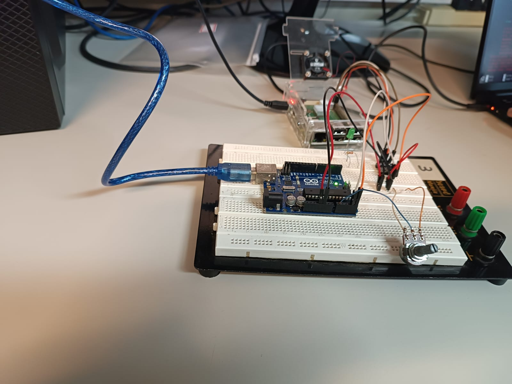

# Atividade Prática - Sistemas Embarcados: Experimento 3

## Descrição Geral
Esta pasta contém os códigos desenvolvidos para as duas partes do Experimento 3 da disciplina de Sistemas embarcados. Conhecimentos em protocolos de comunicação serial foram desenvolvidos por meio de atividades em linguagem Python e Arduino.

## Estrutura dos Arquivos e Descrição
- Parte 1 (I2C)
  - **sketch_i2c_arduino**: *Sketch* Arduino para que o microcontrolador funcione como dispositivo controlado no barramento 0x08 I2C. 
  - **I2C.py**: Código em Python com funções de entrada e saída em I2C.
    - Ao digitar 1 ou 0 no terminal do programa, o LED de um Arduino que tenha sido carregado o `sketch_i2c_arduino`.
    - Ao digitar 'r' no terminal do programa, é feita uma leitura do pino analógico A0 do Arduino e o resultado é impresso na tela em forma de 2 bytes, número inteiro e valor em Volts.
  - **output_i2c.txt**: Registro dos comandos utilizados durante o desenvolvimento e testes da parte 1.
  
  - Abaixo está visível uma foto de montagem envolvida na parte 1:

- Parte 2 (bônus, SPI)
  - **spi.py**: Código em Python com funções para uso de um leitor RFID usando protocolo SPI.
    - Ao digitar um cartão **cadastrado**, um LED verde se acende (enquanto o LED vermelho fica apagado).
    - Ao digitar um cartão **não** cadastrado, um LED vermelho se acende (enquanto o LED verde fica apagado).
  
  - Abaixo está visível um vídeo demonstrando o que foi desenvolvido na parte 2.

## Observações
- Os códigos foram desenvolvidos e testados em ambiente Linux, com hardware Raspberry Pi 3b+.
- Consulte o arquivo PDF "SEL0630_Roteiro_Pratica_3" para mais detalhes do experimento.

---

## Autores

| Nome                        | NUSP     |
|-----------------------------|----------|
| João Pedro Gomes            | 13839069 |
| Giulliano Olivato da Silva  | 9944204  |

