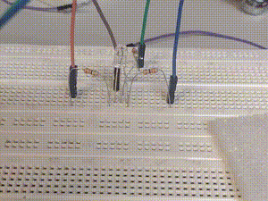

# Atividade Prática - Sistemas Embarcados: Experimento 5

## Descrição Geral
Esta pasta contém os códigos desenvolvidos para o Experimento 5 da disciplina de Projetos em Sistemas Embarcados. O objetivo deste experimento era explorar os conceitos de sistemas operacionais de tempo real (RTOS) utilizando o FreeRTOS no ESP32, incluindo a criação de tarefas, comunicação entre tarefas (semáforos e mutexes) e programação multicore.

## Estrutura dos Arquivos e Descrição

- **part-1-test/src/main.cpp**: Código em C++ para ESP32 que demonstra a leitura de um sensor de toque capacitivo e o controle de um LED onboard. Este arquivo foi utilizado para familiarização inicial com o ambiente de desenvolvimento.

- **part-1-multicore/src/main.cpp**: Código em C++ para ESP32 que demonstra a criação de duas tarefas FreeRTOS.
    - Uma tarefa (`vTask1`) inverte o estado de um LED em intervalos de 200 ms.
    - Outra tarefa (`vTask2`) imprime um contador no monitor serial a cada 1 segundo.
    - Ambas as tarefas são fixadas a diferentes núcleos da CPU do ESP32 (`xTaskCreatePinnedToCore`).

- **part-2/src/main.cpp**: Código em C++ para ESP32 que implementa um sistema com múltiplas tarefas FreeRTOS.
    - Uma tarefa (`vtasktimer`) controla um LED RGB, alterando suas cores com base em um valor de `remaining` (tempo restante).
    - Outra tarefa (`vtaskinterface`) lê dados da porta serial para atualizar o valor de `remaining`.
    - Um `SemaphoreHandle_t` (`remainingMutex`) é usado para proteger o acesso à variável `remaining`, garantindo a comunicação segura entre as tarefas.
    - As tarefas são fixadas a diferentes núcleos da CPU do ESP32 (`xTaskCreatePinnedToCore`).
    - Abaixo está visível uma demonstração da interface serial e controle do LED RGB.
    - 

## Observações
- Os códigos foram desenvolvidos e testados em ambiente PlatformIO para ESP32, utilizando o framework Arduino e FreeRTOS.
- Consulte o arquivo PDF "SEL0630_Roteiro_Pratica_5.pdf" para mais detalhes do experimento.

---

## Autores

| Nome                        | NUSP     |
|-----------------------------|----------|
| João Pedro Gomes            | 13839069 |
| Giulliano Olivato da Silva  | 9944204  |

