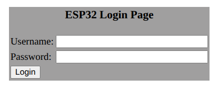
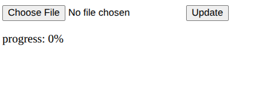
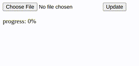

# Atualização OTA via Web Updater em ESP32 com FreeRTOS

## Introdução

### Motivação e Problemática

Em projetos de Internet das Coisas (IoT) e Indústria 4.0, dispositivos embarcados frequentemente necessitam de atualizações de firmware para corrigir bugs, adicionar novas funcionalidades ou aplicar patches de segurança. Realizar essa atualização manualmente, conectando um cabo a cada dispositivo, pode ser um processo inviável, custoso e, frequentemente, impossível, especialmente para equipamentos instalados em locais de difícil acesso.

### Solução Adotada

Este projeto apresenta uma solução prática e eficiente para este problema: um mecanismo de atualização **Over-the-Air (OTA)** implementado em um ESP32. A solução consiste em um servidor web hospedado no próprio dispositivo, que permite o envio de um novo firmware através de um navegador em qualquer máquina conectada à mesma rede Wi-Fi.

Para demonstrar uma arquitetura robusta e comum em sistemas embarcados complexos, o firmware atualizado utiliza o sistema operacional de tempo real **FreeRTOS** para gerenciar tarefas concorrentes, como o próprio servidor web e uma tarefa secundária de piscar um LED, garantindo que a interface de rede permaneça responsiva sem interromper outras funcionalidades do sistema.

## Ferramentas, Bibliotecas e Materiais

### Materiais Utilizados (Hardware)

- Placa de desenvolvimento com ESP32 (ex: ESP32 Dev Kit).
- Cabo micro-USB para programação inicial e alimentação.

### Ferramentas e Bibliotecas (Software)

- IDE: PlatformIO com Visual Studio Code.
- Framework: Arduino para ESP32.
- Bibliotecas Principais:
  - `WiFi.h`: Para conectividade com a rede Wi-Fi.
  - `WebServer.h`: Para a criação do servidor HTTP que hospeda a interface de atualização.
  - `ESPmDNS.h`: Para resolução de nome local (`http://<ip do microcontrolador>`), facilitando o acesso ao dispositivo.
  - `Update.h`: API nativa do ESP32 para realizar o processo de gravação do novo firmware na memória flash.
  - FreeRTOS: Sistema operacional de tempo real (integrado ao core do ESP32 para Arduino) utilizado para gerenciamento de tarefas concorrentes.

## Esquema de Ligação

Não são necessárias ligações externas ou componentes adicionais. O projeto utiliza apenas a placa de desenvolvimento ESP32 e seu LED onboard. A conexão USB é necessária apenas para a primeira gravação do firmware e para alimentar o dispositivo.

## Desenvolvimento e Implementação

O projeto foi dividido em dois firmwares para demonstrar claramente o processo de atualização.

### Firmware A: Ponto de Partida (Sem Blink)

O primeiro firmware é uma aplicação simples que estabelece o ponto de partida. Sua única responsabilidade é iniciar o servidor web e aguardar uma atualização.

- Conectividade: Conecta-se à rede Wi-Fi pré-configurada.
- Servidor Web: Inicia um servidor na porta 80 com os seguintes endpoints:
  - `GET /`: Apresenta a página de login.
  - `POST /login`: Valida as credenciais. Se corretas, redireciona para a página de upload.
  - `POST /update`: Recebe o arquivo de firmware (`.bin`) e utiliza a API `Update` para gravá-lo na partição OTA.
- Lógica: Toda a lógica do servidor é gerenciada dentro da função `loop()` principal do Arduino.

### Firmware B: Versão Atualizada (Com Blink e FreeRTOS)

Este firmware representa a versão "atualizada" do sistema. Ele introduz o uso de FreeRTOS para demonstrar uma arquitetura mais escalável e robusta.

- Multitarefa com FreeRTOS:
  - `WebServerTask`: Uma tarefa dedicada exclusivamente a gerenciar as requisições do servidor web (`server.handleClient()`).
  - `LedBlinkTask`: Uma tarefa que roda em paralelo para piscar o LED onboard a cada segundo. Esta tarefa serve como uma comprovação visual de que o sistema está operante e que a atualização foi bem-sucedida, além de demonstrar que tarefas concorrentes não são bloqueadas pelas requisições de rede.
- Funcionalidade do Servidor: O servidor web continua funcional, permitindo futuras atualizações.

### Fluxo da Atualização OTA

1.  O **Firmware A** é gravado no ESP32 via USB.
2.  O dispositivo se conecta ao Wi-Fi e inicia o servidor web.
3.  O usuário acessa o endereço IP do ESP32 (ou `http://esp32.local`) em um navegador.
4.  Após o login, o usuário faz o upload do arquivo `firmware.bin` compilado do **Firmware B**.
5.  O endpoint `/update` recebe o arquivo em partes (`multipart/form-data`).
6.  A API `Update.write()` grava os bytes recebidos na partição de memória reservada para OTA.
7.  Ao final do upload, `Update.end()` finaliza o processo e `ESP.restart()` reinicia o dispositivo.
8.  O bootloader do ESP32 verifica a nova imagem de firmware, a valida e a executa.
9.  O **Firmware B** começa a rodar, e o LED começa a piscar.

## Configuração e Uso

### Instruções

1.  Configure as Credenciais: Nos arquivos `src/main.cpp` de ambos os firmwares (`No blink` e `With Blink`), atualize as variáveis `ssid` e `password` com os dados da sua rede Wi-Fi.
2.  Gere o Binário de Atualização: Compile o projeto "With Blink" para gerar o arquivo `firmware.bin` que será usado na atualização. No PlatformIO, o arquivo se encontra em `.pio/build/<environment>/firmware.bin` após uma compilação bem-sucedida.
3.  Carregue o Firmware Inicial: Compile e carregue o projeto "No blink" para o ESP32 via cabo USB.
4.  Obtenha o IP: Abra o Serial Monitor (baud rate 115200) para visualizar o endereço IP que o ESP32 recebeu da sua rede.
5.  Acesse a Interface Web: No navegador, acesse `http://<IP_DO_ESP32>` ou `http://esp32.local`.
6.  Faça o Login: Utilize as credenciais padrão: `admin` / `admin`.

    

7.  Envie a Atualização: Na página de upload, selecione o arquivo `firmware.bin` (gerado no passo 2) e clique em "Update". Aguarde o progresso até 100%.

    
    

8.  Verifique o Resultado: Após o upload, o ESP32 reiniciará automaticamente. O LED onboard começará a piscar, confirmando que o **Firmware B** está em execução.

## Resultados e Demonstração

O procedimento de atualização foi realizado com sucesso. Após o envio do Firmware B através da interface web, o ESP32 reiniciou e passou a executar a nova versão do código, como evidenciado pelo LED piscante e pelas mensagens no monitor serial indicando a inicialização das tarefas FreeRTOS.

Resultado visual após a atualização:

## Considerações Finais

O projeto demonstrou com sucesso a implementação de um sistema de atualização OTA para ESP32 utilizando um web updater. A solução é prática para ambientes de desenvolvimento, prototipagem e para produtos que operam em redes locais seguras.

A adoção do FreeRTOS no firmware final ilustrou como estruturar uma aplicação embarcada para lidar com múltiplas tarefas de forma concorrente e não bloqueante, uma prática essencial para sistemas responsivos e escaláveis.

Para aplicações em produção, recomenda-se fortalecer a segurança, implementando HTTPS (com certificados SSL), um sistema de autenticação mais robusto e, possivelmente, a assinatura de firmware para garantir a autenticidade e integridade das atualizações. Além disso, a utilização do sistema de partição dupla do ESP32 é fundamental para garantir um mecanismo de rollback em caso de falha na atualização.

## Referências

- Os códigos-fonte completos do projeto estão disponíveis no repositório.
- Documentação ESP32 para Arduino: https://docs.espressif.com/projects/arduino-esp32/en/latest/

## Autores

| Nome                        | NUSP     |
|-----------------------------|----------|
| João Pedro Gomes            | 13839069 |
| Giulliano Olivato da Silva  | 9944204  |
